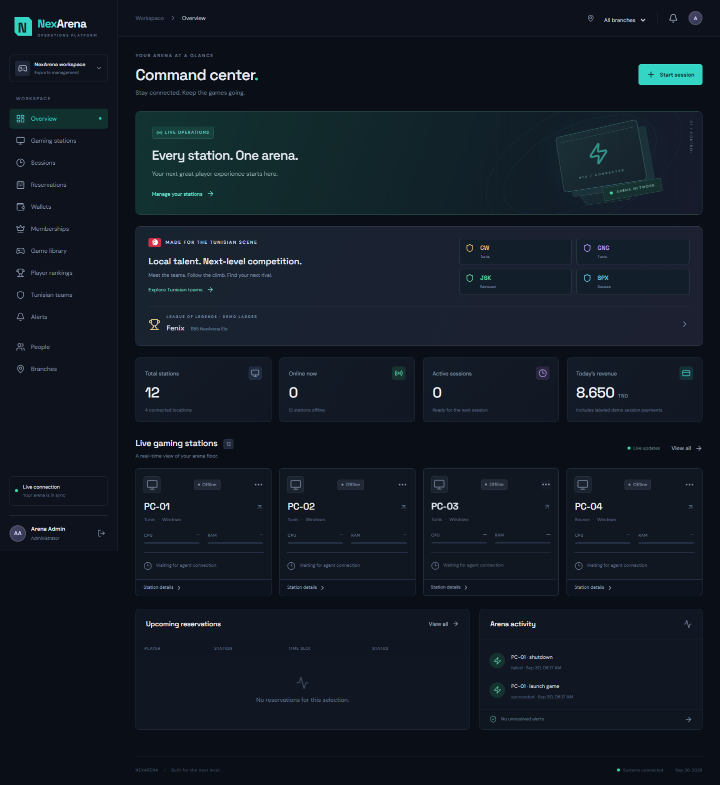

# NexArena

**Esports operations, connected.** A Phase 1 gaming-house platform with a React operations dashboard, a FastAPI/PostgreSQL backend, and a real C# Windows desktop agent.



## What is included

- JWT sign-in, Argon2 password hashing, token revocation on logout, and database-backed role permissions.
- Multi-branch station registration, heartbeats, live connection status, CPU/RAM readings, available temperature/fan sensors, and peripheral alerts.
- Prepaid sessions with live timers, decimal TND billing, transaction-safe wallet deductions, top-ups, and transaction history.
- Membership plan administration and expiring customer memberships.
- Reservations with a daily timeline, availability queries, cancellation, and database-enforced overlap prevention.
- A centralized game library, node assignments, and remote launch requests validated against a second local executable allowlist.
- Windows workstation locking and optional delayed shutdown, command acknowledgments, audit history, and timeout states.
- Responsive dark dashboard, real API data, WebSocket updates/reconnection, loading/empty/error states, and action confirmations.
- Tunisian teams (GNG/JSK references and two fictional squads), 16 labeled demo player profiles, League of Legends and publisher game artwork, and independent per-game Elo ladders with admin-recorded results. See [Tunisian esports](docs/tunisian-esports.md).

Seed records are explicitly demo business records. **Station status and telemetry are never fabricated.** PC-01–PC-04 remain offline until agents connect.

## Stack and structure

| Component | Technology | Location |
|---|---|---|
| Dashboard | React 19, TypeScript, Vite, Tailwind, React Router | `frontend/` |
| API | Python, FastAPI, Pydantic, SQLAlchemy, PyJWT | `backend/app/` |
| Database | PostgreSQL, Alembic, GiST exclusion constraints | `backend/migrations/` |
| Agent | C# / .NET 8 Windows, LibreHardwareMonitor, WMI | `agent/` |
| Tests | PostgreSQL API integration, Playwright, C# safety tests | `backend/tests/`, `frontend/tests/`, `agent-tests/` |
| Deployment | Docker Compose, nginx | `docker-compose.yml` |

See [architecture](docs/architecture.md), [API guide](docs/api.md), [demo script](docs/demo.md), and [verification results](docs/verification.md).

Published repository: [JasserEzzine/NexArena](https://github.com/JasserEzzine/NexArena). The implementation passed [GitHub CI](https://github.com/JasserEzzine/NexArena/actions/runs/36673124169), including the full Docker Compose deployment smoke test.

## Prerequisites

- Docker Desktop with its Linux engine running for Compose; alternatively PostgreSQL 17 installed locally.
- Node.js 22+, Python 3.13 or 3.14, and .NET 8 SDK for local development.
- Windows 10/11 for the agent. Run it in the signed-in player's interactive desktop session.

PostgreSQL's [Windows download page](https://www.postgresql.org/download/windows/) provides a link to standalone binaries. A development-only portable server was used to verify this repository when the local Docker engine could not start.

## Quick start with Docker Compose

From the repository root:

```powershell
python scripts/init-env.py
docker compose up --build -d
docker compose exec backend python -m app.seed
```

Open **http://localhost:8080**. API documentation: **http://localhost:8000/docs**.

`init-env.py` generates `.env` with independent random database, JWT, enrollment, and demo credentials. It will not overwrite an existing file. Alternatively copy `.env.example` and replace all placeholders. Do not commit `.env`.

### Demo sign-in

| Role | Email | Password |
|---|---|---|
| Administrator | `admin@nexarena.local` | `DEMO_PASSWORD` in your local `.env` |
| Staff | `staff@nexarena.local` | The same locally generated `DEMO_PASSWORD` |

Customer records are seeded with wallets but cannot enter the staff dashboard. Seed is idempotent and refuses to seed over existing user data. Changing `DEMO_PASSWORD` after seeding does not change stored password hashes.

## Complete local development setup

### 1. Dependencies and environment

```powershell
python scripts/init-env.py
python -m venv .venv
.\.venv\Scripts\python.exe -m pip install -r backend/requirements.txt
cd frontend
npm ci
cd ..
```

`backend/requirements.lock.txt` records the exact Python packages used for verification. The frontend has a committed npm lockfile. On the current development machine, `scripts/start-portable-db.ps1` restarts the already-initialized local PostgreSQL if needed; its `.tools` binaries and data are intentionally excluded from Git.

### 2. PostgreSQL, migrations, seed

Start just the database with `docker compose up -d db`, or create a PostgreSQL role/database locally matching `.env`. The role must be able to install `btree_gist` in this database; migrations use it to enforce reservation conflicts.

```powershell
cd backend
..\.venv\Scripts\python.exe -m alembic upgrade head
..\.venv\Scripts\python.exe -m app.seed
..\.venv\Scripts\python.exe -m uvicorn app.main:app --host 127.0.0.1 --port 8000
```

### 3. Dashboard (second terminal)

```powershell
cd frontend
npm run dev
```

Open **http://localhost:5173**. Vite proxies `/api` and `/ws` to the backend. After initial setup, `scripts/start-local.ps1` can launch both processes with hidden windows and local log files. It expects PostgreSQL to already be running.

### 4. Real Windows desktop agent

For this machine and the seeded PC-01:

```powershell
.\.venv\Scripts\python.exe scripts/configure-agent.py
dotnet build agent/NexArena.Agent.csproj -c Release
cd agent
dotnet run -c Release -- appsettings.local.json
```

The helper creates `agent/appsettings.local.json` with local backend credentials, the Tunis branch, and `MachineId: demo-pc-01`. It defaults to **monitoring only**. Open the dashboard and watch PC-01 connect and report actual hardware measurements.

For another machine, copy `agent/appsettings.example.json` to `agent/appsettings.local.json`, then configure:

| Setting | Meaning |
|---|---|
| `BackendUrl` | Reachable API URL, e.g. `http://192.168.1.10:8000` on a trusted LAN |
| `EnrollmentKey` | `AGENT_ENROLLMENT_KEY` from the backend environment |
| `BranchId` | Copy the UUID from the dashboard's Branches page |
| `MachineId` | Stable unique identifier; use `demo-pc-01` through `demo-pc-04` to claim seed stations |
| `DisplayName` | Station label |
| `HeartbeatSeconds` / `TelemetrySeconds` | Report intervals; keep below `HEARTBEAT_TIMEOUT` |
| `EnableRemoteCommands` | Set `true` on a dedicated gaming PC to allow approved remote operations |
| `EnableShutdown` | Separate explicit local opt-in for shutdown |
| `AllowedGames` | Map game UUIDs to exact absolute local `.exe` paths |

For LAN agents, start the backend with `--host 0.0.0.0` and allow its port in the host firewall. Do not expose the development server directly to the public internet. Use HTTPS/WSS at a TLS reverse proxy for deployment outside a trusted local environment.

The agent stores its per-machine credential and replay markers under `%LOCALAPPDATA%\NexArena\<MachineId>`. Re-registration requires that credential; changing the shared enrollment key does not replace it. Keep the agent configuration and local state protected by the machine's Windows account permissions.

### Remote game launch

1. Create/edit a game in Game library with its installed Windows `.exe` path.
2. Use the game's `+` control to assign it to a station.
3. Expand the game's Configuration to copy its UUID.
4. Add that UUID and identical executable path to the station agent's `AllowedGames`, then restart the agent.
5. Enable `EnableRemoteCommands` locally and click Launch game.
6. Check Alerts → Remote command history for the actual agent result.

There are no user-controlled shell strings, launch arguments, or remote executable downloads. Sample games are configuration examples; the repository does not install or license them.

## Environment variables

| Variable | Purpose |
|---|---|
| `DATABASE_URL` | SQLAlchemy `postgresql+psycopg://` URL; Compose sets its internal database hostname |
| `POSTGRES_USER`, `POSTGRES_PASSWORD`, `POSTGRES_DB` | Compose database initialization |
| `JWT_SECRET` | At least 32 characters; generated randomly by the helper |
| `AGENT_ENROLLMENT_KEY` | Shared bootstrap key; agents subsequently authenticate with unique local credentials |
| `DEMO_PASSWORD` | At least 10 characters; consumed only during initial seed |
| `CORS_ORIGINS` | Comma-separated allowed dashboard origins |
| `HEARTBEAT_TIMEOUT` | Offline threshold, seconds; default 30 |
| `DB_PORT`, `API_PORT`, `FRONTEND_PORT` | Optional Compose host ports; defaults 5432, 8000, 8080 |

## Tests

With PostgreSQL available and `.env` configured:

```powershell
cd backend
..\.venv\Scripts\python.exe -m pytest -q
cd ../frontend
npm run typecheck
npm run format:check
npm run build
npx playwright install chromium
# Backend and frontend must be running, database seeded:
npm run test:e2e
cd ..
dotnet run --project agent-tests -c Release
docker compose config --quiet
```

Backend tests use a temporary, uniquely named PostgreSQL schema with actual Alembic migrations. They do not use SQLite or wipe your normal data. The test database role needs schema creation permissions. Browser tests use seeded accounts and add 0.001 TND to a demo wallet as an end-to-end write test.

## Operational boundaries

- Run **one backend worker**. Agent connections and dashboard subscriptions are held in process. Multi-worker scaling needs shared event routing and is outside this MVP.
- Session billing is prepaid. When credit is exhausted, billing stops at the last affordable instant and staff receives an alert. This is not an OS kiosk/lockdown product; staff must ensure play stops. Offline stations do not automatically end an otherwise active session.
- Money uses decimal values rounded to 0.001 TND, proportional to elapsed seconds; rates are captured when sessions start. No automatic membership discounts or payment gateway are implied.
- Membership assignment is an internal administrative action. It does not debit the wallet or process a subscription payment; benefits are descriptive.
- Windows cannot be remotely unlocked without credentials. The API returns an explicit unsupported response; unlock locally.
- Some temperature/fan readings require elevated sensor access and compatible hardware. Missing readings are `null`, displayed as `—`; they are never invented. WMI peripheral detection can include virtual devices and cannot guarantee physical theft detection for every hardware/driver configuration.
- Command timeout means the outcome is **unknown**, not that execution definitely failed. Commands are not replayed automatically after reconnect. The agent rejects repeated command IDs.
- Lock and shutdown acceptance tests require a dedicated Windows gaming station. Automated tests verify routing and safety without locking or shutting down the developer's computer.
- No public GitHub repository or demo video is published automatically. The source and three-minute demo script are ready for review and submission.

## Troubleshooting

- **Docker engine pipe missing:** Docker Desktop's Linux engine is not running. Start/repair it or use local PostgreSQL. A valid Compose file does not prove Docker runtime availability.
- **Port 5432 already used:** choose either local PostgreSQL or Compose's database, not both on that port.
- **No tables:** run `alembic upgrade head` before starting the API.
- **Missing `btree_gist`:** install PostgreSQL contrib extensions and grant the database owner permission to install it.
- **Station offline:** verify API URL, branch UUID, enrollment key, local credential file, firewall, and agent logs.
- **403 on re-enrollment:** an existing machine credential differs. Restore its local credential; do not casually reuse a machine ID on a different computer.
- **Remote command failed:** read its agent response in Alerts. Check local opt-in, interactive desktop, installed executable, and allowlist.
- **Sensor unavailable:** try running the agent with authorized elevated permissions on the dedicated gaming station; unsupported sensors stay unavailable.
- **.NET not found:** add the installed SDK directory to PATH. On the development machine it was found under `%LOCALAPPDATA%\Microsoft\dotnet\dotnet.exe`.

## Submission

Review `.gitignore`, avoid adding `.env` or `agent/appsettings.local.json`, and publish only the source. See [demo.md](docs/demo.md) for the Phase 1 walkthrough. Deployment/runtime limitations and executed checks are recorded in [verification.md](docs/verification.md).
