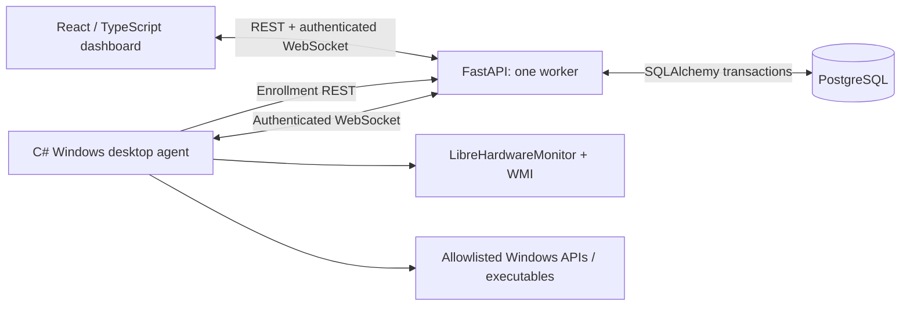

# Architecture

The server owns business state; the dashboard has no simulated telemetry or independent financial state. Dashboard WebSocket events invalidate API snapshots. A 30-second REST refresh provides eventual recovery if an event is missed. The dashboard sends a heartbeat every 20 seconds; the server rechecks its JWT and revocation version. Browser credentials are sent in the first WebSocket frame, never a URL parameter.

Agents enroll with a shared bootstrap key and a randomly generated local per-machine secret. Only the SHA-256 secret digest is stored in PostgreSQL. Subsequent agent sockets authenticate with that credential. A replacement socket supersedes the old connection; the old connection cannot mark the replacement offline. Connection loss immediately marks a node offline; a background sweep also catches stale heartbeats. Startup invalidates any stale ONLINE records.

Telemetry is the latest hardware snapshot, persisted as JSON. An actual `true → false` peripheral transition creates one alert. Repeated disconnected readings do not create duplicate alerts. Historical time-series storage and advanced benchmarking are not in Phase 1.

## Data integrity

- SQLAlchemy foreign keys connect branches, nodes, customers, sessions, wallets, memberships, games and alerts.
- PostgreSQL partial unique indexes allow one active session per node **and per customer**.
- Session start serializes on the node and wallet; session stop locks the session and wallet. Duplicate stops return 409, so a session is billed only once.
- Wallet transactions have a unique reference and a unique optional session ID. Top-ups use an idempotency reference and lock the wallet; reuse with a different amount/customer is rejected.
- Balances cannot become negative. A prepaid session that outlives its wallet balance is finalized at the affordable cutoff. A two-second maintenance sweep also ends sessions when another player's reservation begins and raises an operational alert.
- Reservations use a PostgreSQL GiST exclusion constraint on `(node_id, tstzrange(start_time, end_time, '[)'))`, scoped to confirmed reservations. Adjacent reservations are permitted; overlapping writes are rejected even under concurrency.
- Decimal money is serialized as strings. TND precision is three decimal places.
- UTC timezone-aware timestamps are stored in PostgreSQL; the UI renders local times.

## Authorization

Permissions live in `roles`, keeping checks extensible. Admin has `*`. Staff has `read`, `operate`, and `remote`: staff can start/end sessions, create/cancel reservations, resolve alerts, lock a station, and launch configured games. Only admin manages accounts, branches, plans, catalog configuration, wallet top-ups, and shutdown. Customers have no operations-dashboard permission.

## Remote operations

API requests persist a PENDING command, deliver it to the registered agent socket, and return its command ID. An acknowledgment updates SUCCEEDED or FAILED; unanswered requests become TIMEOUT after 30 seconds. The agent keeps replay markers before executing a command, so repeated delivery is refused. A timeout cannot guarantee that the OS action did not occur.

The agent runs in the Windows user's interactive desktop, not Session 0. Lock uses `LockWorkStation`. Shutdown invokes only the Windows system `shutdown.exe` with fixed arguments and a 30-second delay. Games require both server node assignment and a matching local UUID-to-absolute-path allowlist. It does not accept shell commands, user-supplied arguments, UNC paths, or remote URLs.

## Deployment scope

PostgreSQL stores durable business records; Docker uses a named data volume. nginx serves the built frontend and proxies `/api` and `/ws`. A single FastAPI process owns the socket registry and maintenance task. Use TLS termination for non-local deployments. Backup and retention policies, distributed routing, external billing, Windows kiosk enforcement, and tournament operations are beyond this Phase 1 implementation.
